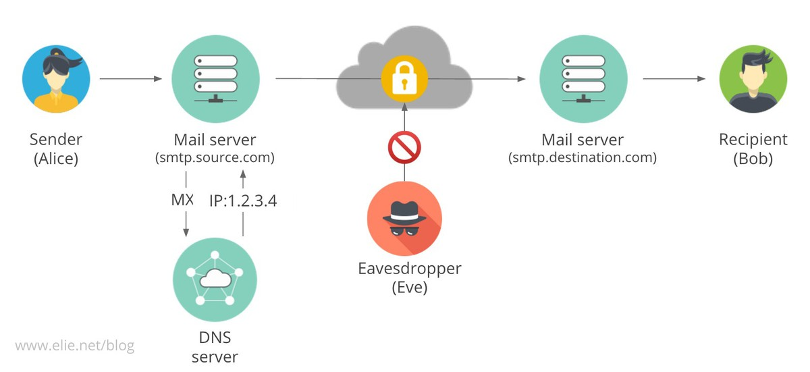

% Sicherheit im Netz von SMTP- und HTTP-Servern
% Paul Menzel (Max-Planck-Institut für molekulare Genetik)
% 9. November 2017

## Wer bin ich?

{ height=25% }\


- Systemarchitekt beim [Max-Planck-Institut für molekulare Genetik](https://www.molgen.mpg.de/)
- Diplom-Wirtschaftsmathematiker ([TU Berlin](https://www.tu-berlin.de/))
- FLOSS-Befürworter

## Präsentation

Folien in Markdown mit [Pandoc](https://pandoc.org/) nach LaTeX-Beamer umgewandelt, verfügbar auf GitHub.

TinyURL: <https://tinyurl.com/smtphttp>

<https://github.com/paulmenzel/sicherheit_im_netz_von_smtp-_und_http-servern>

# Problemstellung

## Ziel

-  Sichere Übertragung von Daten
-  Geheim und authentifiziert

### Betrachtung in Vortrag

-  SMTP: Zwischen SMTP-Servern (MTA)

## Angriffsmodell

-  Annahme: Keine Übernahme der Server durch Angreifer
-  Annahme (SMTP): Vertrauen in Betreiber der Server auf Sender- und (Ziel-)Empfängerseite
-  Annahme (HTTP): Sicherer Browser, HTTP korrekt konfiguriert
-  Mittelsmannangriff

## Mittelsmannangriff

{ height=50% }

## Realistisch?

-  Innerhalb der MPG: DFN-Netz separat vom „Internet“
-  Dienste außerhalb

```
$ host -t mx maxplanckflorida.org
maxplanckflorida.org mail is handled by \
0 maxplanckflorida-org.mail.protection.outlook.com.
$ host -t mx cbs.mpg.de
cbs.mpg.de mail is handled by \
10 mx0-cbs-mpg.heinlein-support.de.
cbs.mpg.de mail is handled by 20 \
mx1-cbs-mpg.heinlein-support.de.
```

-  Netzwerkgeräte meist im Ausland produziert und enthalten BLOBs
-  Snowden-Veröffentlichungen zeigen, dass realistisch

## Lösungen (TLS)

-  SMTP: `STARTTLS`
-  HTTP: HTTPS (Port 443)

-  Zertifizierungsstellen (DFN, [Let’s Encrypt](https://letsencrypt.org/))
-  [Monkeysphere Project](http://web.monkeysphere.info/)
-  DANE

### Nur bei SMTP

-  Ende-zu-Ende-Verschlüsselung (PGP/GPG, S/MIME)

## Zielumsetzung

### SMTP

-  Authentifizierung: Zustellung an korrekten Server
-  Schutz der Metadaten
-  geheime Übertragung auch bei nicht Ende-zu-Ende-Verschlüsselung

### HTTP

-  Authentifizierung: Kommunikation mit korrektem Server (Interaktion)
-  Datenschutz (Metadaten wie URL geschützt)
-  Verschlüsselung

# Angriffe

## Poodle, DROWN, …

Verschiedene Angriffe.

1.  Downgrade-Attacke (STARTTLS)
2.  Poodle, DROWN
3.  Unsichere Chiffren

## Sichere Konfiguration

<postmaster@….mpg.de> nach RFC 822 Pflicht!

1.  [BetterCrypto.org](https://bettercrypto.org/)
1.  [Mozilla Wiki: Security/Server Side TLS](https://wiki.mozilla.org/Security/Server_Side_TLS)
1.  [Cipherli.st](https://cipherli.st/)

## Ideal für SMTP

Mehrere Komponenten: DNS, Zertifikate

### TLS

-   MX-Eintrag stimmt mit Servernamen überein

### DANE

-  TLSA-DNS-Einträge

## Test

### WWW

1.  [Hardenize](https://www.hardenize.com/)
1.  [SSL-Tools](https://ssl-tools.net/)
1.  [SSL Server Test von Qualys SSL Labs](https://www.ssllabs.com/ssltest/analyze.html?d=login.rz.ruhr-uni-bochum.de)

### Kommandozeile

1.  OpenSSL, GnuTLS
1.  [Nmap](https://nmap.org/)
1.  [SSLyze](https://nabla-c0d3.github.io/)
1.  `posttls-finger`

## Beispiel zu posttls-finger

```
$ posttls-finger …
```

# MPG

## Zeitraum

-   8\. November 2017

# Inkorrekte MX-Einträge

## Beispiel GV

```
$ host -t mx mpg.de
mpg.de mail is handled by 5 mx1.mpg.de.
mpg.de mail is handled by 5 mx2.mpg.de.
$ host mx1.mpg.de
mx1.mpg.de has address 194.95.232.60
mx1.mpg.de has address 194.95.238.60
mx1.mpg.de has address 194.95.234.60
$ host 194.95.232.60
60.232.95.194.in-addr.arpa domain name pointer \
mfilter-123-1-1.mx.srv.dfn.de.
```

Keine Antwort von postmaster@mpg.de auf Nachricht.

## Problem Verwaltungsadressen

```
$ host vw.molgen.mpg.de
vw.molgen.mpg.de mail is handled by 5 mx2.mpg.de.
vw.molgen.mpg.de mail is handled by 5 mx1.mpg.de.
```

```
$ host vw.molgen.mpg.de
vw.molgen.mpg.de mail is handled by \
5 mfilter-123-1-2.mx.srv.dfn.de.
vw.molgen.mpg.de mail is handled by \
5 mfilter-123-1-1.mx.srv.dfn.de.
vw.molgen.mpg.de mail is handled by \
5 mfilter-123-1-3.mx.srv.dfn.de.
```

Bitte überprüfen!

GWDG sollte aktiv werden.

# HTTP

## Techniken

1.  Weiterleitung von HTTP zu HTTPS (DNS-Angriff noch möglich)
1.  HSTS (DNS-Angriff bei erstem Zugriff immer noch möglich)
1.  HTTPS Everywhere (EFF)
1.  HKPK
1.  DNSSEC/DANE

## DNSSEC/DANE

1.  Abfrage von DANE nur mit Erweiterungen
1.  Boykott von Browserherstellern (DNSSEC schwer zu handhaben), bevorzugen HKPK

## Problem bei Umsetzung

1.  Historie
1.  Viele alte Dienste ohne HTTPS-Zertifikat, ohne ACME oder Wildcard-Zertifikate schwer zu handhaben
1.  Never-touch-a-running System

## Lösung

1.  SSL-Terminierung (HAProxy)
1.  Wechsel zu [Let’s Encrypt](https://letsencrypt.org/) und Skript, dass Zertifikate in Echtzeit erstellt

## HTTP/2

1.  Standardmäßig HTTPS
1.  Vorteil für mobile Nutzer (besonders bei schlechtem System wie Fiona oder OHB)

# Ausblick

## Sicherheit der Serverprogramme

-   Problem: Dienste von überall erreichbar
-   Beliebige Eingabe (Analyseprogramme (Spam, Virenschutz), Formulare)
-   Untersuchung der Sicherheit der Server
    -   SMTP: Postfix, Exim, …
    -   HTTP: Apache HTTP Server, Nginx, …
-   Finanzierung von Audits und Umsetzung von neuen Methoden

## Fazit

1.  MPG-Netz auch Vorbildwirkung
1.  Mehr Gewissenhaftigkeit
1.  Mehr Bewusstsein (DNSSEC, DFN)
1.  Ohne DANE keine automatische Konfiguration möglich, manuelle Konfiguration erforderlich
1.  Finanzierung von Verbesserung der Browser und Weiterentwicklung der Erweiterungen

# Fragen
